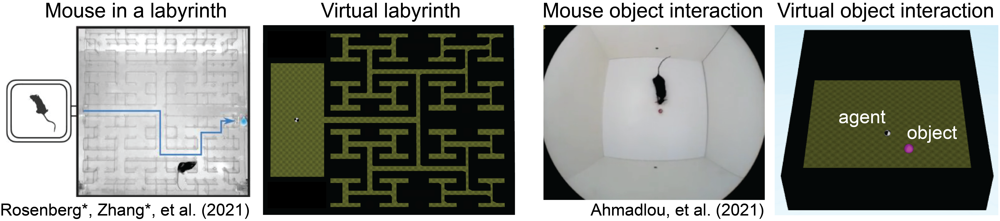

# Plan2Explore on animal-inspired exploration suite

Characterization of Plan2Explore on `adaptgym` animal-inspired exploration suite ([adaptgym](https://pypi.org/project/adaptgym/)).
Agent implementation based on [DreamerV2](https://github.com/danijar/dreamerv2) and [Curious Replay](https://sites.google.com/view/curious-replay).

```
@article{kauvar2023neurobehavior,
  title={Neurobehavior of exploring AI agents},
  author={Kauvar, Isaac and Doyle, Chris and Haber, Nick},
  journal={NeurIPS Intrinsically Motivated Open-ended Learning Workshop},
  year={2023}
}
```

## Adaptgym exploration suite
[Adaptgym](https://pypi.org/project/adaptgym/), which is based on [dm_control](https://github.com/google-deepmind/dm_control),
is a flexible framework for making environments. The two initial environments, inspired based on two animal studies with mice,
are a virtual labyrinth (based on [Rosenberg et al.](https://elifesciences.org/articles/66175)), and
a virtual object interaction assay (based on [Ahmadlou et al.](https://pubmed.ncbi.nlm.nih.gov/33986154/)).

<p align="center">

</p>

## Installation Instructions

To install the Plan2Explore agent and adaptgym, clone the repository, enter the directory, and follow the instructions
below. 

```
conda create -n imol-explore-suite python=3.8 -y
conda activate imol-explore-suite
pip3 install tensorflow==2.6.0 tensorflow_probability==0.14.0 \
             protobuf==3.20.3 ruamel.yaml==0.17.28 \
             'gym[atari]' dm_control==1.0.7 crafter==1.8.0 \
             keras==2.6 matplotlib==3.6.3 pandas==1.3.5 numpy==1.19.5 \
             starr==0.2.1 elements==0.3.2 moviepy==1.0.3
pip install adaptgym
```
Note: there may be an error about conflicting numpy versions -- this does not appear to matter.   
If using a system with a display, you can verify that adaptgym installed properly by running the following. You should see an interactive window pop up.
```
python -c 'from adaptgym.fiddle_env import main; main()'
```

## Experiment Instructions

---

Train on **2 Object novel object** 
```sh
task=admc_sphero_novel_object_2ball
agent=p2e
expid=1
python3 dreamerv2/train.py --logdir ~/logdir/${task}/${agent}/${expid} \
  --configs adaptgym --task ${task} 

python3 dreamerv2/plot_object_interaction.py \
  --logdir ~/logdir/${task}/${agent}/${expid} \
  --outdir ~/logdir/${task}/${agent}/${expid}/plots  
```

Train on **Labyrinth** 
```sh
task=admc_sphero_labyrinth_black
agent=p2e
expid=1
python3 dreamerv2/train.py --logdir ~/logdir/${task}/${agent}/${expid} \
  --configs adaptgym --task ${task} 
  
python3 dreamerv2/plot_labyrinth_trajectory.py \
  --logdir ~/logdir/${task}/${agent}/${expid} \
  --outdir ~/logdir/${task}/${agent}/${expid}/plots  
```

---

Monitor results:

```sh
tensorboard --logdir ~/logdir
```


Note: if running headless and you get this error `ImportError: Cannot initialize a headless EGL display`, you can run:
```sh
sudo killall Xorg
sudo /usr/bin/X :0 &
```
and potentially
```sh
export DISPLAY=:0
```
and potentially
```sh
sudo nvidia-xconfig -a --use-display-device=none
```
  


## Acknowledgments

This repository is largely based on the TensorFlow 2 implementation of [DreamerV2](https://github.com/danijar/dreamerv2). 
We would like to thank [Danijar Hafner](https://danijar.com/) for releasing and updating his clean implementation.


## Tips

- **Efficient debugging.** You can use the `debug` config as in `--configs
crafter debug`. This reduces the batch size, increases the evaluation
frequency, and disables `tf.function` graph compilation for easy line-by-line
debugging.

- **Infinite gradient norms.** This is normal and described under loss scaling in
the [mixed precision][mixed] guide. You can disable mixed precision by passing
`--precision 32` to the training script. Mixed precision is faster but can in
principle cause numerical instabilities.

- **Accessing logged metrics.** The metrics are stored in both TensorBoard and
JSON lines format. You can directly load them using `pandas.read_json()`. The
plotting script also stores the binned and aggregated metrics of multiple runs
into a single JSON file for easy manual plotting.

[mixed]: https://www.tensorflow.org/guide/mixed_precision